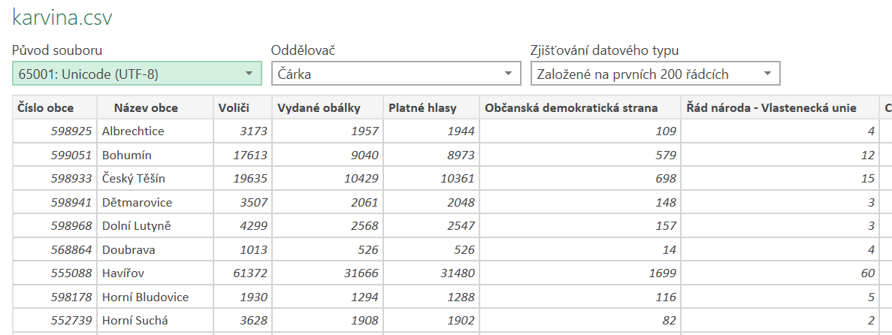
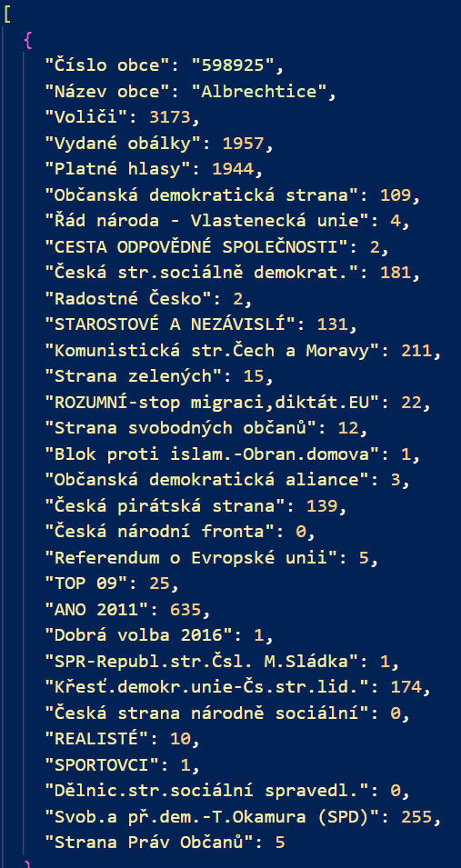
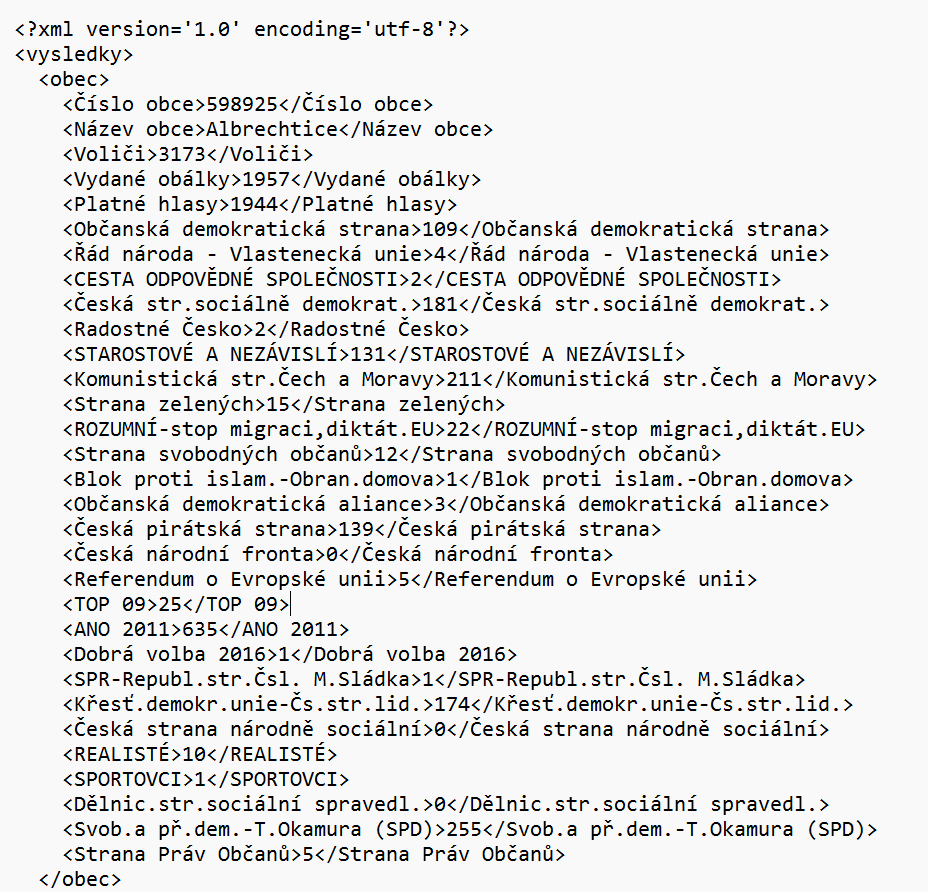
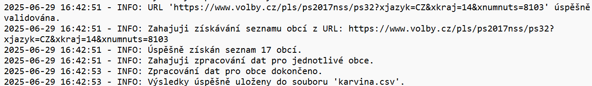
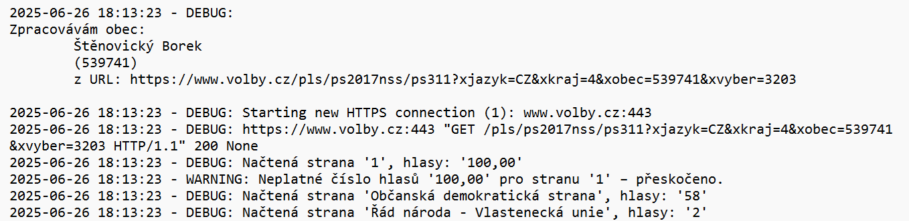
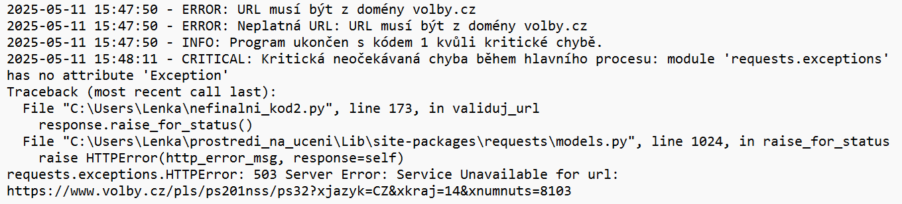

# Web Scraper pro získání volebních výsledků

Tento Pythonový skript slouží k automatizovanému stažení a zpracování volebních dat ze zadané webové stránky (například https://www.volby.cz/pls/ps2017nss/ps32?xjazyk=CZ&xkraj=14&xnumnuts=8103).
Pomocí knihovny BeautifulSoup provádí parsování HTML obsahu a ukládá strukturovaná data do formátu CSV (Comma-Separated Values, hodnoty oddělené čárkou), JSON (JavaScript Object Notation, lehce čitelný formát pro výměnu dat) nebo XML (eXtensible Markup Language, rozšiřitelný značkovací jazyk).  

Projekt je určen jako ukázka praktického použití Pythonu pro web scraping (stahování dat z webu), datové zpracování a práci se soubory. Kód je přehledně rozdělen do modulárních funkcí a obsahuje rozšířené logování a ošetření výjimek.

---
## Obsah:

- [Hlavní funkce](#hlavní-funkce)
- [Struktura projektu](#struktura-projektu)
- [Jak spustit](#jak-spustit)
- [Ukázka výstupu](#ukázka-výstupu)
- [Výstupní soubory ve formátu CSV, JSON a XML](#výstupní-soubory-ve-formátu-csv-json-a-xml)
- [Závislosti](#závislosti)
- [Uložené soubory](#uložené-soubory)
- [Ošetření chyb](#ošetření-chyb)
- [Motivace a cíl](#motivace-a-cíl)
- [Kontakt](#kontakt)

---

## Hlavní funkce
- Stažení HTML obsahu z veřejných webových stránek
- Parsování obsahu pomocí knihovny BeautifulSoup
- Zpracování a extrakce relevantních údajů (např. výsledky voleb, počty hlasů)
- Uložení výstupu do souboru ve formátu CSV, JSON nebo XML
- Robustní ošetření chyb a výjimek (včetně vlastních výjimek)
- Barevný výstup pro přehlednější CLI komunikaci
- Dobře strukturovaný kód vhodný pro rozšíření a testování

## Struktura projektu
Projekt se skládá z následujících částí:
- main.py – hlavní skript pro spuštění programu
- requirements.txt – seznam potřebných knihoven

---

## Jak spustit
Doporučuji vytvořit si virtuální prostředí:

```bash
python -m venv venv

# na UNIX/Linux
source venv/bin/activate

# na Windows
venv\Scripts\activate 
```

Nainstaluj závislosti:
```bash
pip install -r requirements.txt
```

Spusť hlavní skript s URL a cílovým názvem souboru:

Příklad:
```bash
python main.py "https://www.volby.cz/pls/ps2017nss/ps32?xjazyk=CZ&xkraj=14&xnumnuts=8103" "karvina.csv"
```

(soubor se automaticky uloží ve formátu podle volby)
---

## Ukázka výstupu

Během běhu programu je uživatel informován o průběhu: 
```
🔍 Probíhá validace URL: https://www.volby.cz/pls/ps2017nss/ps32?xjazyk=CZ&xkraj=14&xnumnuts=8103
📋 Získávám seznam obcí z adresy...
🔄 Zpracovávám volební data pro jednotlivé obce...
🔄 Celkový počet obcí ke zpracování: 17
💾 Ukládám výsledky do souboru 'karvina.csv' ve formátu CSV...
✅ HOTOVO! Výsledky byly úspěšně uloženy do 'karvina.csv'.
```

 <p align="center">
  
</p>
<p align="center" style="font-size:small; margin-top:4px">
  <em>Spouštění programu přes příkazovou řádku a jeho běh</em>
</p>

---
## Výstupní soubory ve formátu CSV, JSON a XML

Ukázka výstupních souborů:

* CSV (příklad)

Zkrácená ukázka, celý obsah najdete v souboru karvina.csv:

Číslo obce,Název obce,Voliči,Vydané obálky,Platné hlasy,Občanská demokratická strana,Řád národa - Vlastenecká unie,CESTA ODPOVĚDNÉ SPOLEČNOSTI,Česká str.sociálně demokrat.,Radostné Česko,
598925,Albrechtice,3173,1957,1944,109,4,2,181,2,
599051,Bohumín,17613,9040,8973,579,12,4,1241,9,

<p align="center">
  
</p>
<p align="center" style="font-size:small; margin-top:4px">
  <em>Výsledky hlasování za okres Karviná z roku 2017 v CSV formátu</em>
</p>


* JSON (příklad)

Zkrácená ukázka, celý obsah najdete v souboru karvina.json:

```json
[
  {
    "Číslo obce": "598925",
    "Název obce": "Albrechtice",
    "Voliči": 3173,
    "Vydané obálky": 1957,
    "Platné hlasy": 1944,
    "Občanská demokratická strana": 109,
    "Řád národa - Vlastenecká unie": 4,
    
  },
  ...
]
```
<p align="center">
  
</p>
<p align="center"style="font-size:small; margin-top:4px">
  <em>Výsledky hlasování za okres Karviná z roku 2017 v JSON formátu</em>
</p>


* XML (příklad)

Zkrácená ukázka, celý obsah najdete v souboru karvina.xml:
```
<?xml version='1.0' encoding='utf-8'?>
<vysledky>
  <obec>
    <Číslo obce>598925</Číslo obce>
    <Název obce>Albrechtice</Název obce>
    <Voliči>3173</Voliči>
    <Vydané obálky>1957</Vydané obálky>
    <Platné hlasy>1944</Platné hlasy>
    <Občanská demokratická strana>109</Občanská demokratická strana>
    <Řád národa - Vlastenecká unie>4</Řád národa - Vlastenecká unie>
    <CESTA ODPOVĚDNÉ SPOLEČNOSTI>2</CESTA ODPOVĚDNÉ SPOLEČNOSTI>
</obec>
```
<p align="center">
  
</p>
<p align="center" style="font-size:small; margin-top:4px">
  <em>Výsledky hlasování za okres Karviná z roku 2017 v XML formátu</em>
</p>

---

## Závislosti
Projekt využívá tyto knihovny: 

- requests
- beautifulsoup4
- colorama (barevný výstup v terminálu)

Všechny závislosti jsou uvedeny v souboru requirements.txt.

---

## Uložené soubory

Výsledná data jsou uložena do souboru ve formátu dle volby uživatele:  

- CSV (například vysledky.csv),
- JSON (například vysledky.json),
- XML (například vysledky.xml).

---

## Ošetření chyb
Program zachytává následující chyby:  

- Chyby při stahování stránky (například špatná URL, timeout),
- Chyby při parsování HTML (nevalidní struktura),
- Chyby při zápisu na disk (například nedostatečná oprávnění),
- Neočekávané chyby, které jsou zaznamenány do logu a uživateli sděleny.

Používají se vlastní výjimky, například:  

- FileSavingError při ukládání,
- DataParsingError při parsování HTML,
- NoDataFoundError při nenalezení dat,
- UnsupportedFormatError při chybné volbě formátu.

### Logování
Logovací soubory jsou automaticky vytvářeny ve složce log s názvem volby_scraper.log. Do něj jsou zaznamenávány všechny důležité události, včetně chyb a průběhu zpracování, což usnadňuje diagnostiku a ladění.

<p align="center">
  
</p>
<p align="center" style="font-size:small; margin-top:4px">
  <em>Ukázka informace o průběhu zpracování</em>
</p>

<p align="center">
  
</p>
<p align="center" style="font-size:small; margin-top:4px">
  <em>Ukázka o podrobnějším průběhu zpracování</em>
</p>

<p align="center">
  
</p>
<p align="center" style="font-size:small; margin-top:4px">
  <em>Ukázka o chybném průběhu zpracování</em>
</p>

---


## Motivace a cíl
Tento projekt vznikl v rámci studia Pythonu. Cíle byly:  

- Naučit se pracovat s reálnými daty z webu,
- Získat zkušenosti s knihovnami jako BeautifulSoup, requests,
- Vyzkoušet psaní robustního a rozšiřitelného kódu,
- Dokumentovat projekt pro prezentaci a budoucí využití.

---

## Kontakt
Pokud máš otázky nebo zpětnou vazbu:
📧 l.krcmarikova@seznam.cz 

---
[](LICENSE)
---

📌 Poznámka:
Tento skript není určen pro masové stahování dat. Prosím, respektuj pravidla webu, 
ze kterého data čerpáš (robots.txt, fair use).


